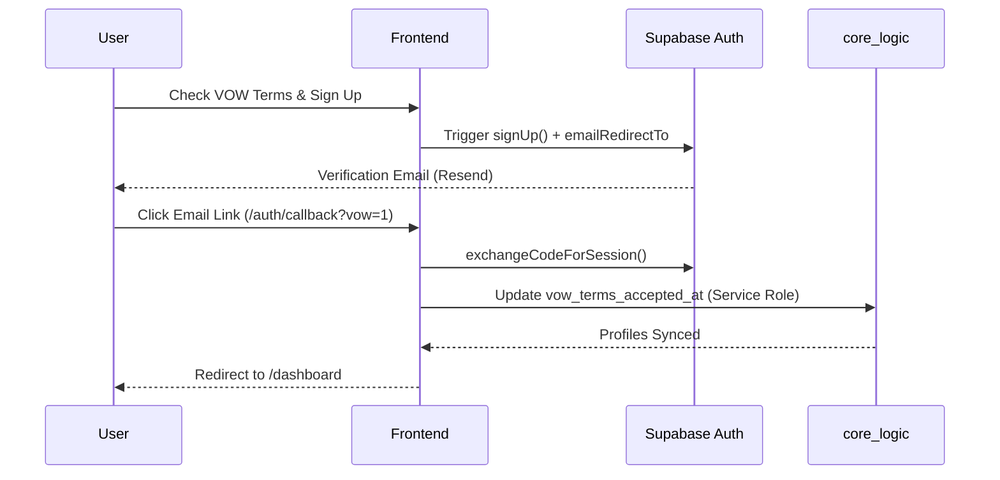

# 🏗️ Client UX Architectural Handoff & Blueprint

This document contains the exact structural wiring, data schemas, compliance constraints, and edge routing developed for the `ListingBooth` Client Portal.

> [!NOTE]
> Provide this document seamlessly to **BOOTHS.AI Central Command** to merge the ListingBooth VOW infrastructure with your parallel VIP Client Portal design. You can merge the front-ends by mapping your sophisticated UI onto the database flows outlined below.

---

## 1. The VOW Registration & Auth Flow

### Process Pipeline
1. **User Action:** Submits email/password on [signup/page.tsx](file:///c:/ANTIGRAVITY/LISTINGBOOTH/src/app/signup/page.tsx).
2. **Frontend Lock:** Component absolutely requires the **VOW Terms of Acceptance** checkbox to be true before hitting `supabase.auth.signUp()`.
3. **Magic Link Trigger:** Supabase sends a verification email (via Resend) pointing to `https://listingbooth.com/auth/callback?vow=1`.
4. **Edge Callback Intercept:** In [auth/callback/route.ts](file:///c:/ANTIGRAVITY/LISTINGBOOTH/src/app/auth/callback/route.ts), if the link exchanges successfully, it intercepts `?vow=1`.
5. **Profile Stamp:** The callback uses a `service_role` connection to explicitly stamp the `core_logic.user_profiles` table with `vow_terms_accepted_at: new Date()`.



---

## 2. Core Infrastructure Schemas

The frontend flows depend strictly on this Postgres layer defined in [setup_user_profiles.sql](file:///c:/ANTIGRAVITY/LISTINGBOOTH/scripts/setup_user_profiles.sql).

### `core_logic.user_profiles`
- **id** (UUID) → References `auth.users(id)` [PK]
- **email** (Text)
- **vow_terms_accepted_at** (TIMESTAMPTZ) → Critical for exposing Sold Data.

**Triggers & Automation:**
- `on_auth_user_created` runs AFTER INSERT on `auth.users`, forcing a 1:1 row creation in `user_profiles`.
- **Omni-Gateway Webhooks:** The central gateway listens to this table in the DB layer for new inserts, generating CRM leads in Follow Up Boss silently.

---

## 3. The "Hard Verification" Compliance Gate

To adhere strictly to CREA / TRREB Board rules, all Sold Data and Premium History is locked behind a strict Edge verification check. 

### Data Masking Engine
Whenever a frontend component hits the Live DDF database (e.g., Maps API `POST /api/listings/bounds`), the edge route runs a Hard Verification matrix:

```typescript
// 1. Must have a valid session token
// 2. MUST have clicked the email link (email_confirmed_at != null)
if (authData?.user && authData.user.email_confirmed_at != null) {
  // 3. MUST have legally checked the VOW acceptance box during signup
  const { data: profile } = await adminDb.schema('core_logic').from('user_profiles')
     .select('vow_terms_accepted_at').eq('id', authData.user.id).single();
     
  isVowAuthenticated = !!profile?.vow_terms_accepted_at;
}
```
If `isVowAuthenticated` evaluates to `false`, the Route explicitly nullifies the data dynamically:
```typescript
if (!isVowAuthenticated) { l.close_price = null; }
```
*Reference File:* [bounds/route.ts](file:///c:/ANTIGRAVITY/LISTINGBOOTH/src/app/api/listings/bounds/route.ts)

---

## 4. The VIP Dashboard Backend Flow

The `ListingBooth` dashboard leverages dynamic component hydration based on two primary API vectors.

### Favorites Synchronization
- **File:** [api/favorites/route.ts](file:///c:/ANTIGRAVITY/LISTINGBOOTH/src/app/api/favorites/route.ts)
- Returns an array of `listing_key` values for a specific user. Handles toggling inserts/deletes seamlessly out of `public.user_favorites`.

### AI Property Recommendations
- **File:** [api/recommendations/[id]/route.ts](file:///c:/ANTIGRAVITY/LISTINGBOOTH/src/app/api/recommendations/%5Bid%5D/route.ts)
- **Process:**
  1. Frontend fetches a random `listing_key` out of the user's saved favorites.
  2. The frontend POSTs that key to the Recommendation API.
  3. The Edge pulls the seed home's `address_city`, `property_type`, and `list_price`.
  4. The Edge calculates a `+/- 25%` price band dynamically.
  5. The Edge runs a geospatial Supabase lookup for up to 4 homes matching those coordinates computationally and returns them structured for the Dashboard UI grid.

### Layout File Merge Action
The current dashboard [dashboard/page.tsx](file:///c:/ANTIGRAVITY/LISTINGBOOTH/src/app/dashboard/page.tsx) leverages the functional wiring but acts primarily as a placeholder. **MERGE GOAL:** Connect the sophisticated Booths.ai Client Portal UI directly to these API endpoints (`/api/recommendations` and `/api/favorites`) to achieve perfect functionality and aesthetic parity.
